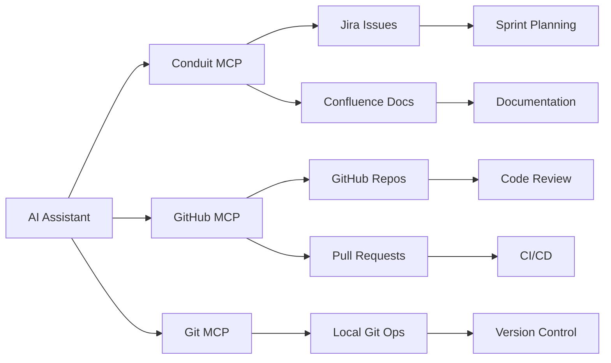

# Development MCP Servers

A collection of Model Context Protocol (MCP) servers designed to enhance developer workflows by providing AI assistants with seamless access to essential development tools and platforms.

## Overview

These MCP servers bridge the gap between AI assistants and development tools, enabling automated workflows, intelligent assistance, and streamlined development processes. Each server provides secure, controlled access to specific platforms while maintaining enterprise-grade security and compliance.

## Available Servers

### 🔧 [Conduit](./conduit/) - Enterprise Knowledge Integration
**Jira & Confluence Integration**

Conduit is a comprehensive enterprise knowledge integration service that provides unified access to Atlassian tools through both CLI and MCP interfaces.

**Key Features:**
- **Jira Integration**: Complete issue lifecycle management, sprint planning, board management
- **Confluence Integration**: Page creation, content management, knowledge base access
- **Multi-Site Support**: Manage multiple Atlassian instances with site aliases
- **Security First**: Policy enforcement, audit trails, and controlled access
- **AI-Optimized**: Content formatting and conversion for LLM consumption

**Use Cases:**
- Automated issue creation and updates
- Sprint planning and management
- Documentation generation and updates
- Knowledge base queries and content retrieval
- Cross-platform workflow automation

### 🌐 [MCP GitHub](./mcp-github/) - GitHub Operations
**Complete GitHub Workflow Integration**

A comprehensive GitHub MCP server providing full access to GitHub's capabilities through a secure, structured interface.

**Key Features:**
- **Repository Management**: Create, fork, manage repositories and branches
- **Issue & PR Workflows**: Complete issue and pull request lifecycle management
- **Code Operations**: File operations, commits, merging, and code review
- **Search & Discovery**: Code, repository, and user search capabilities
- **Security**: Code scanning, secret detection, and security alerts
- **Team Collaboration**: Notifications, assignments, and review processes

**Use Cases:**
- Automated PR creation and management
- Code review assistance and automation
- Issue triage and management
- Repository maintenance and organization
- Security monitoring and compliance

### 🔀 [MCP Git](./mcp-git/) - Local Git Operations
**Secure Local Git Management**

Provides secure, controlled Git operations for local repositories without exposing dangerous command-line interfaces.

**Key Features:**
- **Repository Operations**: Initialize, clone, status, and configuration
- **Branch Management**: Create, switch, merge, and delete branches
- **Commit Workflow**: Stage, commit, and push with validation
- **History & Analysis**: Log viewing, diff analysis, and change tracking
- **Security Controls**: Command validation and policy enforcement

**Use Cases:**
- Automated local Git workflows
- Safe repository maintenance
- Branch strategy enforcement
- Commit message standardization
- Change tracking and analysis

### 🏗️ [MCP Cookie Cutter](./mcp-cookie-cutter/) - Server Development Template
**MCP Server Scaffolding**

A development template and scaffolding tool for creating new MCP servers with best practices and standardized structure.

**Key Features:**
- **Project Templates**: Pre-configured MCP server structure
- **Best Practices**: Security, logging, and configuration patterns
- **Development Tools**: Testing frameworks and development workflows
- **Documentation**: Automated documentation generation

**Use Cases:**
- Rapid MCP server development
- Standardized server architecture
- Development workflow consistency
- Testing and deployment automation

## Workflow Integration

### AI-Enhanced Development Workflows

These servers enable powerful AI-assisted development workflows:



### Example Workflow Scenarios

#### 1. Feature Development Lifecycle
```
1. AI creates Jira issue (Conduit) → 
2. AI creates GitHub branch (GitHub MCP) → 
3. AI implements changes (Git MCP) → 
4. AI creates PR with documentation (GitHub MCP + Conduit)
```

#### 2. Bug Triage and Resolution
```
1. AI analyzes issue in Jira (Conduit) → 
2. AI searches related code (GitHub MCP) → 
3. AI creates fix branch (Git MCP) → 
4. AI updates documentation (Conduit)
```

#### 3. Sprint Planning Automation
```
1. AI reviews backlog (Conduit) → 
2. AI analyzes repository state (GitHub MCP) → 
3. AI creates sprint plan (Conduit) → 
4. AI assigns issues to developers (Conduit)
```

## Installation & Setup

### Prerequisites
- Python 3.10+ (for Python-based servers)
- Go 1.21+ (for Go-based servers)
- Valid API tokens for target platforms
- MCP-compatible AI assistant (Claude Desktop, Cursor, etc.)

### Quick Start

1. **Choose your servers** based on your development stack
2. **Configure credentials** for each platform (Jira, GitHub, etc.)
3. **Install the servers** following individual README instructions
4. **Configure your AI assistant** to use the MCP servers
5. **Start automating** your development workflows

### Configuration Example (Claude Desktop)

```json
{
  "mcpServers": {
    "conduit": {
      "command": "mcp-server-conduit"
    },
    "github": {
      "command": "github-mcp-server",
      "env": {
        "GITHUB_TOKEN": "your-token-here"
      }
    },
    "git": {
      "command": "mcp-server-git"
    }
  }
}
```

## Security & Compliance

### Enterprise-Ready Security
- **Authentication**: Secure API token management
- **Authorization**: Role-based access controls
- **Audit Trails**: Complete operation logging
- **Policy Enforcement**: Organizational workflow compliance
- **Data Protection**: Secure credential handling

### Best Practices
- Regular token rotation
- Principle of least privilege
- Audit log monitoring
- Network security controls
- Data encryption at rest and in transit

## Development & Contribution

### Project Structure
```
development/
├── conduit/           # Jira/Confluence MCP server
├── mcp-github/        # GitHub MCP server  
├── mcp-git/          # Git operations MCP server
└── mcp-cookie-cutter/ # MCP server template
```

### Contributing
1. Fork the repository
2. Create a feature branch
3. Follow the coding standards in each project
4. Add tests for new functionality
5. Update documentation
6. Submit a pull request

### Creating New Servers
Use the cookie-cutter template to bootstrap new MCP servers:
```bash
cd mcp-cookie-cutter
# Follow the template instructions
```

## Support & Documentation

- **Individual Server Docs**: See each server's README for detailed documentation
- **MCP Protocol**: [Model Context Protocol Specification](https://modelcontextprotocol.io/)
- **API References**: Platform-specific API documentation in each server
- **Examples**: Workflow examples and use cases in server documentation

## Roadmap

### Planned Features
- **Enhanced Security**: Advanced authentication and authorization
- **Workflow Orchestration**: Multi-server workflow automation
- **Analytics**: Development metrics and insights
- **Additional Platforms**: Support for more development tools
- **AI Optimization**: Improved AI assistant integration

### Platform Expansion
- GitLab integration
- Azure DevOps support
- Slack/Teams integration
- CI/CD platform support
- Project management tools

---

These MCP servers represent a new paradigm in AI-assisted development, providing secure, intelligent automation for common development workflows while maintaining the flexibility and control developers need.
